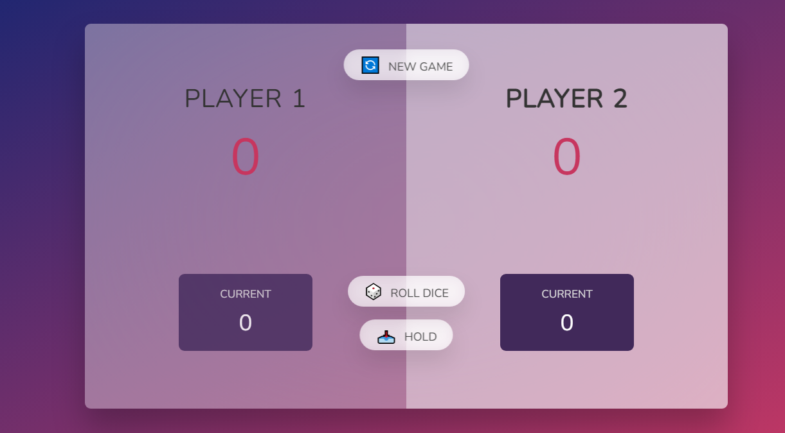

## **<h2 align="center"> 🎲 Dice Roller Game 💻</h2>**

<h2 align="center"> 
        🏆🏆
</h2>
 

  <a href="#computer-demonstration-of-the-application">Demonstration of the Game</a>&nbsp;&nbsp;&nbsp;|&nbsp;&nbsp;&nbsp;
  <a href="#star-features">Features</a>&nbsp;&nbsp;&nbsp;|&nbsp;&nbsp;&nbsp;
  <a href="#rocket-technologies-used">Technologies used</a>&nbsp;&nbsp;&nbsp;|&nbsp;&nbsp;&nbsp;
  <a href="#information_source-application-installation"> How to play the game </a>

# :computer: Demonstration of the Game

  

 

<h3 align="center"> 
	Application status: Developed ✔️
</h3>
 

## 📓 About
This project was developed on the <a href="https://www.udemy.com/course/the-complete-javascript-course/" target="_blank"> Javascript </a> course using Dom manipulation techniques , the user can roll a dice and a random number between one and six is added to his/her score.

## :star: Features
- [x] Start a new game
- [x] roll a dice
- [x] Hold score

## :rocket: Technologies used:

	
	
	

## ⚠️Game Rules
- [x]  The game has two players , playing in rounds.
- [x]  In each turn, a player rolls a dice as many times as he wishes. Each result get added to his ROUND score
BUT, if the player rolls a 1, all his ROUND score gets lost. After that, it's the next player's turn.
- [x]  The player can choose to 'Hold', which means that his ROUND score gets added to his GLOBAL score. After that, it's the next player's turn.
- [x]   The first player to reach 30 points on GLOBAL score wins the game. 

 

## :information_source: Application installation
- `https://github.com/hariyebk/Roll-dice-game.git` to clone the repository

 
